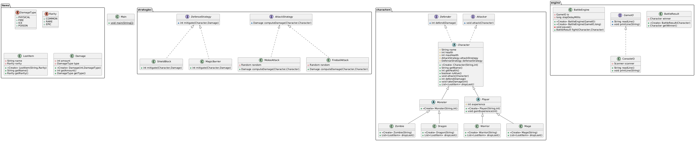

# Legends of Java

**Legends of Java**, Java kullanılarak geliştirilmiş bir **konsol tabanlı RPG savaş simülasyonu**dur.  

---

##  Projenin Amacı

- Java'da **nesne yönelimli programlama (OOP)** kavramlarını ileri seviyede uygulamalı öğrenmek  
  - Abstract sınıflar, interface'ler, inheritance, polymorphism  
- **Strateji tasarım desenini** gerçek bir senaryoda kullanmak  
- Konsol tabanlı bir oyun ile **BattleEngine, IO yönetimi ve savaş logu** gibi sistemleri geliştirmek  
- **Enumlar, value objectler ve composition** gibi kavramları pekiştirmek  
- Proje, **kod yapısı ve UML tasarımı** ile birlikte bir mini RPG uygulamasının baştan sona geliştirilmesini öğretir  

---

##  Özellikler

- **Karakterler**: Warrior, Mage (oyuncular), Dragon, Zombie (canavarlar)  
- **Stratejiler**:  
  - Saldırı: MeleeAttack, FireballAttack  
  - Savunma: ShieldBlock, MagicBarrier  
- **Savaş Motoru**:  
  - BattleEngine ile gerçek zamanlı savaş  
  - BattleResult ile kazanan ve savaş logu  
- **Eşyalar ve Enumlar**:  
  - LootItem ve Rarity  
  - Damage ve DamageType  

---

##  Proje Yapısı

```
com.legendsofjava
│
├─ characters
│ ├─ Character.java
│ ├─ Player.java
│ ├─ Monster.java
│ ├─ Warrior.java
│ ├─ Mage.java
│ ├─ Dragon.java
│ └─ Zombie.java
│
├─ strategies
│ ├─ AttackStrategy.java
│ ├─ DefenseStrategy.java
│ ├─ MeleeAttack.java
│ ├─ FireballAttack.java
│ ├─ ShieldBlock.java
│ └─ MagicBarrier.java
│
├─ items
│ ├─ Damage.java
│ ├─ DamageType.java
│ ├─ LootItem.java
│ └─ Rarity.java
│
├─ engine
│ ├─ BattleEngine.java
│ ├─ BattleResult.java
│ ├─ GameIO.java
│ └─ ConsoleIO.java
│
└─ Main.java
```

---

### Örnek Bir Savaş Çıktısı

```
Battle starts: Aragorn vs Smaug
Round 1
Aragorn attacks Smaug for 15 damage!
Smaug attacks Aragorn for 25 damage!
Round 2
Aragorn attacks Smaug for 18 damage!
Smaug attacks Aragorn for 22 damage!
...
Winner: Smaug
```

---

